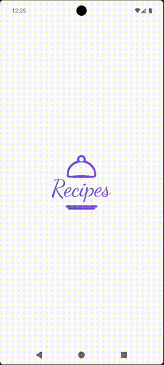

---

# RecipeComposeApp


[](https://codecov.io/gh/bullet-true/RecipeComposeApp)

Android-приложение с **offline-first архитектурой, локальным кешированием и реактивным UI на Jetpack Compose**.

Проект демонстрирует разработку современного Android-приложения с использованием **Jetpack Compose, MVVM, Room, DataStore, Retrofit, Kotlin Coroutines и Dependency Injection**.

---

# ✨ Основные возможности

* просмотр категорий рецептов
* каталог рецептов внутри категории
* экран деталей рецепта:

  * список ингредиентов
  * пошаговые инструкции
  * изменение количества порций
  * автоматический пересчёт ингредиентов
* добавление рецептов в избранное
* сохранение избранных рецептов
* offline-режим благодаря локальному кешированию
* загрузка данных с удалённого API
* поддержка deep links
* интерфейс в стиле **Material Design 3**

---

# 🏗 Архитектура

Приложение построено по принципам **Clean Architecture + MVVM** и использует однонаправленный поток данных.

```
UI (Jetpack Compose)
         ↓
     ViewModel
         ↓
     Repository
   ↓            ↓
Room DB      Retrofit API
```

### Основные принципы

* UI получает состояние через **StateFlow**
* ViewModel управляет состоянием экрана
* Repository объединяет работу с API и локальной базой
* локальная база используется как **source of truth**
* данные синхронизируются с сервером при наличии сети

Подход **offline-first** позволяет приложению работать даже без интернет-соединения.

---

# 🛠️ Технологический стек

## UI

* Jetpack Compose
* Material Design 3
* LazyColumn / LazyVerticalGrid
* Coil (загрузка изображений)

---

## Архитектура

* MVVM
* ViewModel
* StateFlow
* Repository Pattern
* Feature-based структура проекта

---

## Навигация

* Navigation Compose
* передача аргументов между экранами
* deep links

---

## Работа с сетью

* Retrofit
* OkHttp
* Kotlinx Serialization

---

## Локальное хранение

* Room Database
* DataStore Preferences
* Offline-first кеширование

---

## Dependency Injection

* **Dagger Hilt**
* модульная конфигурация зависимостей
* упрощённое управление зависимостями приложения

---

## Тестирование

* **JUnit** — unit-тесты бизнес-логики
* **MockK** — мокирование зависимостей
* **Turbine** — тестирование Flow и StateFlow
* **Coroutines Test** — тестирование корутин
* **Room Testing** — тестирование базы данных
* **MockWebServer** — тестирование сетевого слоя
* **Hilt Testing** — DI в инструментальных тестах
* **Compose UI Test** — тестирование Compose-экранов
* **Kaspresso** — E2E UI-тесты с поддержкой Compose
* **JaCoCo** — отчёты покрытия кода
* **Codecov** — визуализация и мониторинг покрытия
* **GitHub Actions** — CI/CD pipeline

---

# 📦 Структура проекта

```
app
├── core
│   ├── datastore
│   ├── network
│   ├── ui
│   ├── utils
│   └── extensions
├── data
│   ├── database
│   ├── model
│   └── repository
├── features
│   ├── categories
│   ├── recipes
│   ├── details
│   └── favorites
└── ui
    └── theme
```

---

# 🔄 Работа с данными

В проекте используется **offline-first подход**:

1. приложение сначала получает данные из **локальной базы**
2. затем выполняется запрос к **удалённому API**
3. при получении новых данных база обновляется
4. UI автоматически получает обновлённое состояние

Это позволяет:

* работать без интернета
* ускорить загрузку экранов
* повысить стабильность приложения

---

# 🧪 Тестирование

Проект покрыт тестами.

## Unit-тесты

* тестирование ViewModel через **JUnit + MockK**
* тестирование StateFlow и событий через **Turbine**
* тестирование корутин через **Coroutines Test**

## Интеграционные тесты

* тестирование Room Database через **Room Testing**
* тестирование Repository с реальной базой данных
* тестирование сетевого слоя через **MockWebServer**
* DI в тестах через **Hilt Testing**

## UI-тесты

* тестирование Compose-экранов через **Compose UI Test**
* E2E сценарии через **Kaspresso** с поддержкой Compose
* тестирование навигации и deep links

## Покрытие кода

* отчёты генерируются через **JaCoCo**
* визуализация покрытия в **Codecov**

## CI/CD

* автоматический запуск тестов при каждом push через **GitHub Actions**
* линт и сборка APK в pipeline
* артефакты отчётов сохраняются при падении

---

# 🚀 Что демонстрирует проект

Этот проект показывает практические навыки разработки Android-приложений с использованием современного стека:

* Jetpack Compose
* реактивное управление состоянием
* Clean Architecture
* offline-first архитектура
* локальное кеширование данных
* Dependency Injection
* многоуровневое тестирование (unit, интеграционные, UI, E2E)
* настройка CI/CD pipeline с GitHub Actions
* мониторинг покрытия кода через Codecov
